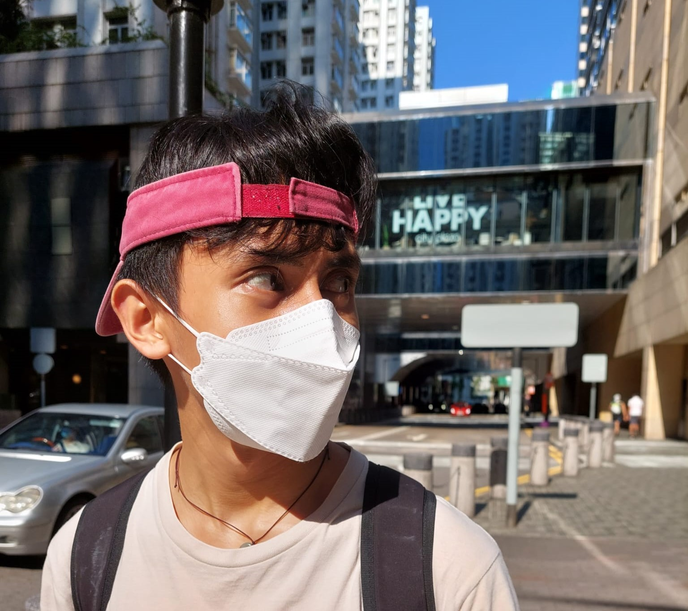

Hi! I'm Ali Adnan - a software developer in Hong Kong, you can read more <a href='/about'>about me here</a> - or read about what I've been doing below 

</img>

Latest Projects:

- [terminal-ssr](https://github.com/aliadnani/terminal-ssr): Server-side rendered terminal UIs
</img>
- [curves](https://github.com/aliadnani/curves): 3D Point Cloud Curve Reconstruction
</img>
- [robotic-welding](https://github.com/aliadnani/robotic-welding): Gesture controlling a $20k robotic arm
</img>