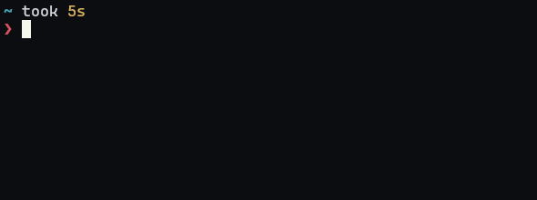

Hi! I'm Ali Adnan - a software developer in Hong Kong, you can read more <a href='/about'>about me here</a> - or read about what I've been doing below 

</img>

Latest Projects:

- terminal-ssr: Server-side rendered terminal UIs
</img>
- curves: 3D Point Cloud Curve Reconstruction
<!--  -->
</img>
- robotic-welding: Gesture controlling a $20k robotic arm
</img>